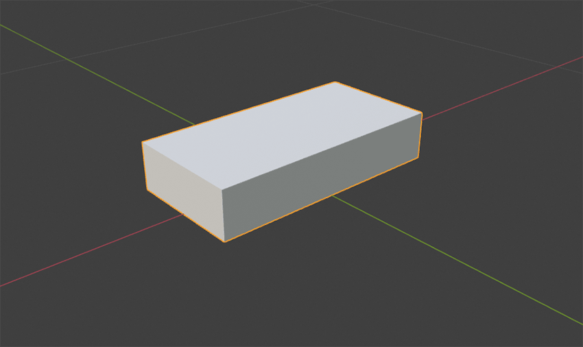
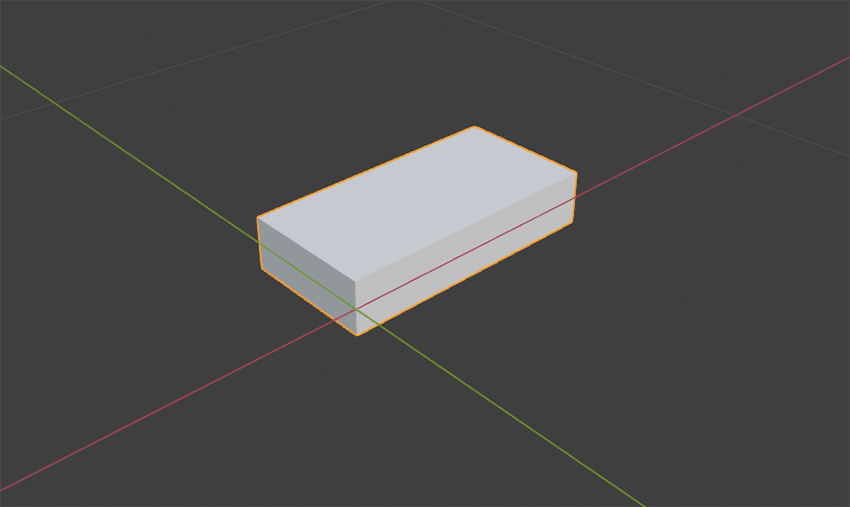

# L3D

**L**uminaire **3D** (XML Format)

The L3D geometry format allows luminaires to be defined by Wavefront .OBJ files. The L3D is a ZIP-compressed archive that contains at least the OBJ files and a **`structure.xml`** file. The XML file can be used to define the OBJ models position, rotation and other attributes to form a complex model with the necessary light emission surfaces. Optionally, different components of a luminaire with degrees of freedom can be defined, e.g. to represent gimbal systems or luminaires with movable objects.

## L3D Container specification

### General

- The container files' underlying format is a standard ZIP archive
- The container file extension is .L3D

### Root Folder Content

- In the root of the container file, the following elements are expected
  - Mandatory: **L3D-XML** file, with the file name **`structure.xml`**
  - Mandatory: At least one directory with .OBJ file and the corresponding MTL/Texture files if available.

### L3D-XML File

- Filename
  - The **filename** of the **L3D-XML** inside the root directory must be **`structure.xml`**
- The **L3D-XML** file is expected to be valid as follows
  - Valid XML syntax
  - Valid against the referenced l3d.xsd, see below.
  - Invalid XMLs files may not be parsed and lead to errors

### **L3D-XSD** Schema

- The official **L3D-XSD** Schema can always be found published at [github.com/globallightingdata/l3d/](https://github.com/globallightingdata/l3d/)
- The **L3D-XSD** has to be referenced by the raw versioned github url. In example for the pre release version 0.1: https://raw.githubusercontent.com/globallightingdata/l3d/v0.1/xsd/l3d.xsd

### Directories

- Each model has to be placed in a separate directory where the directory name matches the **`id`** of the [**`GeometryFileDefinition`**](#GeometryFileDefinition) which uses the model.
- All material library and texture files have to be placed in the same directory as the corresponding model.

## Model Files

Version 1 of the L3D-Format only supports Wavefront .obj files. Including the material files .mtl . From the material file the diffuse color and diffuse texture data are supported, for now.  
**The .obj files must not contain more than one object per file.**

## Textures

Supported Texture formats:

- JPEG
- PNG

# L3D-XML Reference

## XML-Elements

### **`Luminaire`**

The Root-Element in the xml file. Must appear exactly once.

#### Child elements

- [**`Header`**](#Header) (mandatory)
- [**`GeometryDefinitions`**](#GeometryDefinitions) (mandatory)
- [**`Structure`**](#Structure) (mandatory)

### **`Header`**

Contains some meta-information about the model and how it has been created.

#### Child elements

- **`CreatedWithApplication`** (mandatory)  
  The tool/software which was used to create this xml file. Must appear once.
- **`CreationTimeCode`** (mandatory)
  The date of the creation in format YYYY-MM-DDThh:mm:ss. Must appear once.
- `Name`
  If there is a distinct name for this model, this can be mentioned here. May appear once.
- `Description`
  Some text as model description. May appear once.

### **`GeometryDefinitions`**

References all model files which are used in this luminaire geometry.

#### Child elements

- [**`GeometryFileDefinition`**](#GeometryFileDefinition) (mandatory)
  Must appear at least once

### **`GeometryFileDefinition`**

References a model file in the models directory.

#### Attributes

- **`id`** (mandatory)
  A unique id, which must start with a letter and contain only letters and digits.
- **`filename`** (mandatory)  
  The name of a file in the models directory.
- **`units`** (mandatory)  
  The units used in the referenced model file.

### **`Structure`**

Contains the fixed geometries of the luminaire.

#### Child elements

- [**`Geometry`**](#Geometry) (mandatory)  
  Must appear at least once.

### **`Geometry`**

A single geometry part of the luminaire.

#### Attributes

- **`partName`** (mandatory)  
  A user defined name of the part. Must be unique throughout all [**`Geometry`**](#Geometry), [**`Joint`**](#Joint) and [**`LightEmittingObject`**](#LightEmittingObject) elements and must start with a letter.

#### Child elements

- [**`Position`**](#Position) (mandatory)  
  Position of the geometry relative to the parent joint or the insert point of the luminaire. Must appear exactly once.
- [**`Rotation`**](#Rotation) (mandatory)  
  Rotation of the geometry around the local axes. Must appear axactly once.
- [**`GeometryReference`**](#GeometryReference) (mandatory)  
  A reference to the above defined GeometryFileDefinition, which defines the geometry ot this part. Must appear exactly once.
- **`Joints`**  
  Contains all joint in the current geometry part. May appear exactly once. Each joint is represented by a child [**`Joint`**](#Joint) element.
- **`LightEmittingObjects`**  
  Contains all light emitting object of the current geometry part. Has to appear exactly once. Each light emitting object is represented by a [**`LightEmittingObject`**](#LightEmittingObject) element
- **`LightEmittingSurfaces`**  
  Contains all light emitting surface definitions in this geometry object. Each light emitting surface is represented by a [**`LightEmittingSurface`**](#LightEmittingSurface) element.

### **`GeometryReference`**

References a geometry from the [**`GeometryFileDefinitions`**](#GeometryFileDefinition) section.

#### Attributes

- **`geometryId`** (mandatory)  
  The `id` defined in one of the [**`GeometryFileDefinition`**](#GeometryFileDefinnition) elements.

### **`Joint`**

Describes a joint between two different geometry parts.

#### Attributes

- **`partName`** (mandatory)  
  A user defined name of the part. Must be unique throughout all [**`Geometry`**](#Geometry), [**`Joint`**](#Joint) and [**`LightEmittingObject`**](#LightEmittingObject) elements and must start with a letter.

#### Child elements

- [**`Position`**](#Position) (mandatory)  
  Position of the joint relative to the parent geometry part. Must appear exctly once.
- [**`Rotation`**](#Rotation) (mandatory)  
  Rotation around the local part axes. Must appear exactly once.
- [**`XAxis`**](#XAxis-YAxis-ZAxis)  
  Describes the degrees of freedom on the x axis if set.
- [**`YAxis`**](#XAxis-YAxis-ZAxis)  
  Describes the degrees of freedom on the y axis if set.
- [**`ZAxis`**](#XAxis-YAxis-ZAxis)  
  Describes the degrees of freedom on the z axis if set.
- [**`DefaultRotation`**](#DefaultRotation)  
  Values to pre set the joint angle in the target software.
- **`Geometries`** (mandatory)  
  Contains all child geometries which are attached through this joint. Must contain at least one [**`Geometry`**](#Geometry) element.

### **`LightEmittingObject`**

Describes a light emitting object which can be referenced in the [**GLDF**](https://github.com/globallightingdata/gldf/)-File

#### Attributes

- **`partName`** (mandatory)  
  A user defined name of the part. Must be unique throughout all [**`Geometry`**](#Geometry), [**`Joint`**](#Joint) and [**`LightEmittingObject`**](#LightEmittingObject) elements and must start with a letter. This name can be referenced in the [**GLDF**](https://github.com/globallightingdata/gldf/)-File

#### Child elements

- **`Position`** (mandatory)  
  Position of the light emitting object relative to the parent geometry part. Must appear exactly once.
- **`Rotation`** (mandatory)  
  Rotation of the light emitting object around the local axes.
- One of the following shaping elements:
  - [**`Rectangle`**](#Rectangle)
  - [**`Circle`**](#Circle)

### **`XAxis`**, **`YAxis`**, **`ZAxis`**

Enables and describes the degrees of freedom for the corresponding axis. The resulting rotation axis is affected by the [**`Position`**](#Position) and [**`Rotation`**](#Rotation) properties of the current part.

#### Attributes

- **`Min`** (mandatory)  
  The minimal angle for the joint **in degrees**.
- **`Max`** (mandatory)  
  The maximal angle for the joint **in degrees**.
- **`Step`** (mandatory)  
  The angle step (**in degrees**) in which the joint can be articulated.

### **`DefaultRotation`**

Default values to pre set the joint angle values in the target software.

#### Attributes

- **`x`** (mandatory)
  Default value for the angle of the x axis **in degrees**.
- **`y`** (mandatory)  
  Default value for the angle of the y axis **in degrees**.
- **`z`** (mandatory)  
  Default value for the angle of the z axis **in degrees**.

### **`Position`**

Position of the current part relative to the parent part or the insert point in case of a fixed root part.

#### Attributes

- **`x`** (mandatory)  
  x translation **in meters**
- **`y`** (mandatory)  
  y translation **in meters**
- **`z`** (mandatory)  
  z translation **in meters**

### **`Rotation`**

Rotation of the current part around the local axes.
**The rotation order is fixed to ZXY.**

#### Attributes

- **`x`** (mandatory)  
  Rotation around the local x axis **in degrees**.
- **`y`** (mandatory)  
  Rotation around the local y axis **in degrees**.
- **`z`** (mandatory)  
  Rotation around the local z axis **in degrees**.

### **`Rectangle`**

Describes a rectangular shape.

#### Attributes

- **`sizeX`** (mandatory)  
  Size of the rectangle in x direction **in meters**.
- **`sizeY`** (mandatory)  
  Size of the rectangle in y direction **in meters**.

### **`Circle`**

Describes a circular shape.

#### Attributes

- **`diameter`** (mandatory)  
  The diameter of the circle **in meters**.

### **`LightEmittingSurface`**

Describes the relation between [**`LightEmittingObject`s**](#LightEmittingObject) and the faces of the parent geometry model which should act as light emitting surfaces.

#### Attributes

- **`partName`** (mandatory)  
  A user defined name of the part. Must be unique throughout all luminaire parts

#### Child elements

- [**`LightEmittingObjectReference`**](#LightEmittingObjectReference) (mandatory)  
  Refernce to a defined [**`LightEmittingObject`**](#LightEmittingObject). Must appear at least once.

### **`LightEmittingObjectReference`**

Defines a relation to an existing `LightEmittingObject`

#### Attributes

- **`lightEmittingPartName`** (mandatory)  
  Contains the `partName` of an defined `LightEmittingObject`
- **`intensity`**  
  The intensity of the light emitting surface at which the surface should _glow_.

#### Child elements

- [**`FaceAssignments`**](#FaceAssignments) (mandatory)  
  Contains all face assignments. Must appear exactly once.

### **`FaceAssignments`**

Contains a series of [**`FaceAssignment`**](#faceassignment) or [**`FaceRangeAssignment`**](#facerangeassignment) elements

### **`FaceAssignment`**

Assigns a surface/triangle in the model to act as a light emitting surface.

#### Attributes

- **`faceIndex`** (mandatory)  
  The zero based index of the surface/triangle in the model.
- **`groupIndex`**  
  If the model contains more than one group, this attribute can be used to indicate which group the surface/triangle index belongs to.

### **`FaceRangeAssignment`**

Assigns multiple surfaces/triangles in the model to act as light emitting surfaces. The indices of the surfaces/triangles must be successive in order to use `FaceRangeAssignment`

#### Attributes

- **`faceIndexBegin`** (mandatory)  
  The starting index which should be assigned. Must be lower than `faceIndexEnd`.
- **`faceIndexEnd`** (mandatory)
  The last index which should be assigned. Must be greater than `faceIndexBegin`.
- **`groupIndex`**  
  If the model contains more than one face group, this attribute can be used to indicate which group the surface/triangle index belongs to.

## Examples

### Example 1: Simple Cube Luminaire (example_000)

Assuming in the models directory is a cube.obj file available which contains a simple cube with the following data:

- Length: 0.5m
- Width: 0.25m
- Height: 0.1m

##### Example 1 cube



We want to add a LightEmittingObject at the bottom of the cube and create a luminaire with the insert point at the center of the bottom face.
The following example xml creates exactly what we want.

```xml
<?xml version="1.0" encoding="UTF-8"?>
<Luminaire xmlns:xsi="http://www.w3.org/2001/XMLSchema-instance" xsi:noNamespaceSchemaLocation="https://gldf.io/l3d.xsd">
  <Header>
    <CreatedWithApplication>Example-Tool</CreatedWithApplication>
    <CreationTimeCode>2021-03-03T10:10:10</CreationTimeCode>
  </Header>
  <GeometryDefinitions>
    <GeometryFileDefinition id="cube" filename="cube.obj" units="m" />
  </GeometryDefinitions>
  <Structure>
    <Geometry partName="luminaire">
      <Position x="0" y="0" z="0" />
      <Rotation x="0" y="0" z="0" />
      <GeometryReference geometryId="cube" />
      <LightEmittingObjects>
        <LightEmittingObject partName="leo">
          <Position x="0" y="0" z="0" />
          <Rotation x="0" y="0" z="0" />
          <Rectangle sizeX="0.5" sizeY="0.25" />
        </LightEmittingObject>
      </LightEmittingObjects>
      <LightEmittingSurfaces>
        <LightEmittingSurface partName="les">
          <LightEmittingObjectReference lightEmittingPartName="leo" />
          <FaceAssignments>
            <FaceAssignment faceIndex="3" />
          </FaceAssignments>
        </LightEmittingSurface>
      </LightEmittingSurfaces>
    </Geometry>
  </Structure>
</Luminaire>
```

#### Cube Geometry

To reference the `cube.obj` file in the models directory, we need to create a [**`GeometryFileDefinition`**](#GeometryFileDefinition) in the `GeometryFileDefinitions` element and set the attributes. The **`id`** attribute can freely be chosen but must start with a letter and must be unique among all **`GeometryFileDefinition`** elements in the XML file. The **`filename`** has to be `cube.obj` without the models directory path. Sinse the `cube.obj` file coordinates are in meters, we neet to set the **`units`** attribute to **m**.

After that we can create a [**`Geometry`**](#Geometry) element in the [**`Structure`**](#Structure) element. The **`partName`** also can be chosen freely but must be unique among all [**`Geometry`**](#Geometry), [**`Joint`**](#Joint) and [**`LightEmittingObject`**](#LightEmittingObject) elements, and must also start with a letter.

As we see the cube is already placed correctly, so we don't need any translation or rotation of the geometry in this example.

To tell that this geometry element has to use the `cube.obj` as gometry source, we need to create a reference to the defined [**`GeometryFileDefinition`**](#GeometryFileDefinition). We do that by creating a [**`GeometryReference`**](#GeometryReference) element and set the **`geometryId`** attribute to the id we defined in the **`GeometryFileDefinition`** - _cube_.

#### Light Emitting Object

To add a light emitting object to our luminaire we need to create a [**`LightEmittinObject`**](#LightEmittingObject) in the **`LightEmittingObjects`** element of the current geometry part. The **`partName`** attribute can freely be chosen just as in the [**`Geometry`**](#Geometry) element. The only difference ist that this name will be referenced by the **GLDF-XML**.

Initially the light emitting object will be placed relative to the parent geometry part. In this [example](#Example-1-cube) the initial position is coincidentally at the right position.

The shape of the light emitting object can be rectangular or circular. To define the shape of the light emitting object we need to create a [**`Rectangle`**](#Rectangle) or a [**`Circle`**](#Circle) child element in our LightEmittingObject element. In this case the shape is rectangular, so we need to create a **`Rectangle`** element. Sinse the light emitting object corresponds to the whole bottom surface the attributes `sizeX` and `sizeY` equal the length and width of the cube.

#### Light Emitting Surfaces

As the last step we have to indicate which of the cube surfaces/triangles should act as the light emitting surfaces. We know that the light emitting object is on the bottom of the cube so the bottom surface should act as light emitting surface too. In this cube the triangle indices of the bottom surface are 6 and 7.

To indicate that this two triangle should act as light emitting surface we need to create a **`LightEmittingFaceAssignments`** element with two **`Assignment`** child elements. Each for every triangle. The **`Assignment`** element needs the attributes **`faceIndex`** and **`lightEmittingPartName`**. **`faceIndex`** is the (zero based) triangle index in the model and the **`lightEmittingPartName`** is **`partName`** of the **`LightEmittingObject`** element this light emitting surface is related to.

In case you have many successive triangle indices you could also use the **`FaceRangeAssignment`** element, which takes the attributes **`faceIndexBegin`** and **`faceIndexEnd`** instead of a single **`faceIndex`**.

### Example 2: Cube Luminaire With Translated Parts (example_001)

Assuming in the models directory is a cube.obj file available which contains a simple cube with the following data:

- Length: 0.5m
- Width: 0.25m
- Height: 0.1m

##### Example 2 cube



We want to create a luminaire with a light emitting object at the bottom of the luminaire. Just like in the previous example. The only difference is that this time the geometry doesn't align with the insert point.
Here we have to make some adjustemnts in order to create the exact same luminaire as in the last example.

The xml below contains these adjustments.

```xml
<?xml version="1.0" encoding="UTF-8"?>
<Luminaire xmlns:xsi="http://www.w3.org/2001/XMLSchema-instance" xsi:noNamespaceSchemaLocation="https://gldf.io/l3d.xsd">
  <Header>
    <CreatedWithApplication>Example-Tool</CreatedWithApplication>
    <CreationTimeCode>2021-03-03T10:10:10</CreationTimeCode>
  </Header>
  <GeometryDefinitions>
    <GeometryFileDefinition id="cube" filename="cube.obj" units="m" />
  </GeometryDefinitions>
  <Structure>
    <Geometry partName="luminaire">
      <Position x="-0.25" y="-0.125" z="0.05" />
      <Rotation x="0" y="0" z="0" />
      <GeometryReference geometryId="cube" />
      <LightEmittingObjects>
        <LightEmittingObject partName="leo">
          <Position x="0.25" y="0.125" z="-0.05" />
          <Rotation x="0" y="0" z="0" />
          <Rectangle sizeX="0.5" sizeY="0.25" />
        </LightEmittingObject>
      </LightEmittingObjects>
      <LightEmittingSurfaces>
        <LightEmittingSurface partName="les">
          <LightEmittingObjectReference lightEmittingPartName="leo" />
          <FaceAssignments>
            <FaceAssignment faceIndex="3" />
          </FaceAssignments>
        </LightEmittingSurface>
      </LightEmittingSurfaces>
    </Geometry>
  </Structure>
</Luminaire>
```

#### Cube Geometry

As we know the cube is not placed as we want it, so we need to correct that by moving the cube to the right position. We move the cube by minus half size in x and minus half size in y direction and up by half of its height. The model doesn't need any rotation, but the element is mandatory.

#### Light Emitting Object

Initially the light emitting object will be placed relative to the parent geometry part. In this [example](#Example-2-cube) the initial position would be in the corner of the cube (zero position), which is not what we want. In order to correct that we need to move the light emitting object to the correct position. Coincidentally the values to move the light emitting object are the negative values of the values we used for the geometry position.
